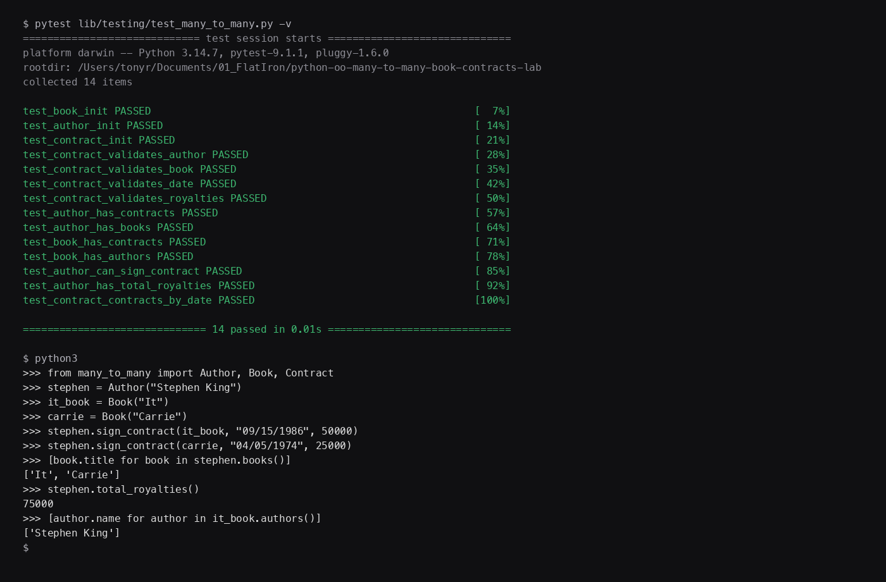

# Book Contracts

Python models for publishing contracts. An author can write many books, a book can have many authors, and a `Contract` sits in the middle with the date and royalty terms.

This project is the completed Flatiron lab on many-to-many object relationships.

## Screenshot



The screenshot shows all 14 tests passing, plus a short demo of `Author.sign_contract()`, related books, and `total_royalties()`.

## Features

- Create a `Book` with a `title`
- Create an `Author` with a `name`
- Create a `Contract` that links one author to one book
- Look up related contracts, authors, and books through the join
- Sign a contract from the author side with `sign_contract()`
- Total an author's royalties across every contract
- Filter contracts by date with `Contract.contracts_by_date()`

## Class design

| Class | Attributes | Methods |
| --- | --- | --- |
| `Book` | `title`, `all` | `contracts()`, `authors()` |
| `Author` | `name`, `all` | `contracts()`, `books()`, `sign_contract(book, date, royalties)`, `total_royalties()` |
| `Contract` | `author`, `book`, `date`, `royalties`, `all` | `contracts_by_date(date)` |

`Contract` properties raise an exception if the types are wrong: `author` must be an `Author`, `book` must be a `Book`, `date` must be a string, and `royalties` must be an integer.

`authors()` and `books()` do not store the other side directly. They walk `Contract.all` and return the matching objects.

## Getting started

Requires Python 3.8 or later.

```bash
python3 -m venv .venv
source .venv/bin/activate
pip install pytest
```

## Usage

```python
from many_to_many import Author, Book, Contract

stephen = Author("Stephen King")
it_book = Book("It")
carrie = Book("Carrie")

stephen.sign_contract(it_book, "09/15/1986", 50000)
stephen.sign_contract(carrie, "04/05/1974", 25000)

print([book.title for book in stephen.books()])
# ['It', 'Carrie']

print(stephen.total_royalties())
# 75000

print([author.name for author in it_book.authors()])
# ['Stephen King']

print(len(Contract.contracts_by_date("09/15/1986")))
# 1
```

A book can also have more than one author. Each extra contract adds another author through the same join:

```python
peter = Author("Peter Straub")
peter.sign_contract(it_book, "06/01/1984", 20000)

print([author.name for author in it_book.authors()])
# ['Stephen King', 'Peter Straub']
```

## Tests

```bash
source .venv/bin/activate
pytest lib/testing/test_many_to_many.py -v
```

Expected result: 14 passing tests covering initialization, contract validation, related lists, `sign_contract()`, `total_royalties()`, and `contracts_by_date()`.

## License

This repository uses the [Learn.co Educational Content License](LICENSE.md).
